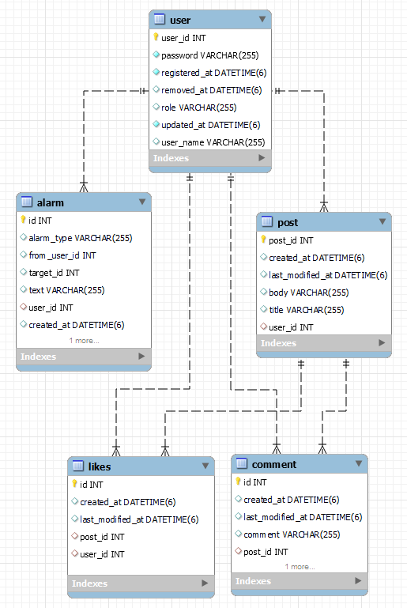

# 스프링부트 SNS 프로젝트

- 회원가입, 로그인, 글쓰기, 조회, 수정, 삭제, 알람, 좋아요, 댓글 기능
- [Swagger-ui](http://ec2-3-38-172-197.ap-northeast-2.compute.amazonaws.com:8080/swagger-ui/#/)
---
### 프로젝트 설명
#### 🥇 기술 스택
- 에디터 : Intellij Ultimate
- 개발 툴 : SpringBoot 2.7.5
- 자바 : JAVA 11
- 빌드 : Gradle 6.8
- 서버 : AWS EC2
- 배포 : Docker, gitlab
- 데이터베이스 : MySql 8.0
- 필수 라이브러리 : SpringBoot Web, MySQL, Spring Data JPA, Lombok, Spring Security

#### 🥈 ERD Diagram

#### 🥉 EndPoint

