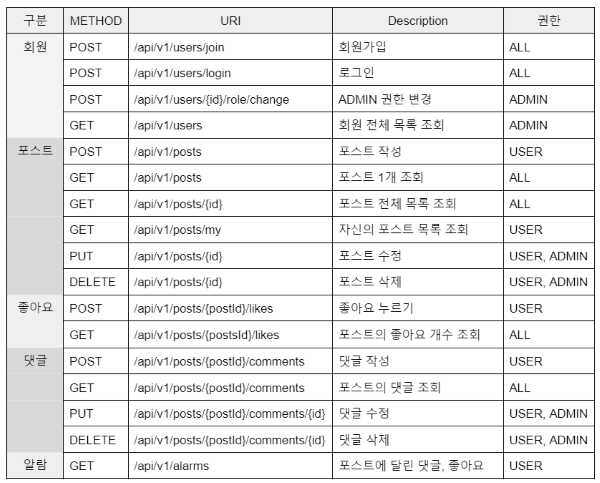

# 📧 My SNS 프로젝트 

> **주요기능 및 결과** 
    - 회원가입, 로그인, 글쓰기, 조회, 수정, 삭제, 알람, 좋아요, 댓글  
    [Swagger-ui](http://ec2-3-38-172-197.ap-northeast-2.compute.amazonaws.com:8080/swagger-ui/#/)
---

## 🥇 요구사항
#### 기술 스택
- 에디터 : Intellij Ultimate
- 개발 툴 : SpringBoot 2.7.5
- 자바 : JAVA 11
- 빌드 : Gradle 6.8
- 서버 : AWS EC2
- 배포 : Docker, gitlab
- 데이터베이스 : MySql 8.0
- 필수 라이브러리 : SpringBoot Web, MySQL, Spring Data JPA, Lombok, Spring Security

#### EndPoint

---

## 🥈 기능 구현
### 인프라
- [x] EC2 생성 및 도커 설치
- [x] gitlab 배포파일 및 ec2 크론탭 설정

### DataBase
- [x] Mysql 구축
- [x] DB 설계

### Swagger UI 
- [x] swagger 설정
- [x] Spring Security에 적용 `SecurityFilterChain`

### Spring Security + JWT 
- [x] 회원가입과 로그인
- [x] admin 권한 (Role 역할) 구현 `enum`

### Spring Boot
- [x] 게시글 CRUD 구현
- [x] 댓글 CRUD 구현
- [x] 좋아요 누르기, 조회 기능 구현
- [x] 마이피드 기능 구현
- [x] 알람 기능 구현 (alarmType `enum` > `좋아요`, `댓글`)
- [x] Entity에 soft delete 적용
- [x] 예외 처리 `@exceptionHandler`
- [x] Jpa Auditing

### Test Code
- [x] controller 테스트 코드
    - user, post, like, comment, alarm
- [ ] service 테스트 코드 

### UI
- [ ] 화면ui 설정
---

## 🥉구조 
#### ERD

#### Architecture
- 레이어드 아키텍처
    - 역할에 따라 독립된 모듈로 나누어서 구성하는 패턴입니다. 
    - 각 모듈이 서로의 의존도에 따라 층층히 쌓듯이 연결되어서 전체의 시스템을 구현하는 구조
    - 특징 : 단방향 의존성. 각각의 레이어는 오직 자기보다 하위에 있는 레이어에만 의존

## 💬 회고
#### 신경 쓴 부분
Dto 설계를 할 때 하나의 클래스가 한 가지 기능만 갖는 단일 책임 원칙을 지키게끔 만들어보았다.
- request dto, response dto
- service controller 사이에서 변환하는 dto
#### 개선사항
Controller list 조회 test code
- 인접한 service 레이어가 아닌 repository 객체를 사용했는데 이 부분 리팩토링이 필요하다.
- Controller에서 페이징 처리된 로직을 테스트 하기 위해 PageImpl을 이용해 직접 Page<dto> 객체를 만들어 주었는데,이때 null Pointer 에러가 발생했다.
- 때문에 이 에러를 피하기 위해서 repository객체를 통해 직접 save해주었다.

#### 추가사항
Service test 코드 완성
- TestInfoFixture을 사용해서 작성

UI 완성 시켜보기
- 리액트를 이용해서 만들기

 
#### 느낀점
1주차와 비교해 헤매는 시간이 줄었다. 낯선 에러들을 만났을 때 구글링하는 법을 조금이나마 터득한 것 같다.😌

한편 테스트 코드 작성에 어려움을 느꼈는데, 추가적으로 JUnit을 공부하면서 익숙해질 때까지 만들어보는 노력이 필요할 것  같다.🤐
