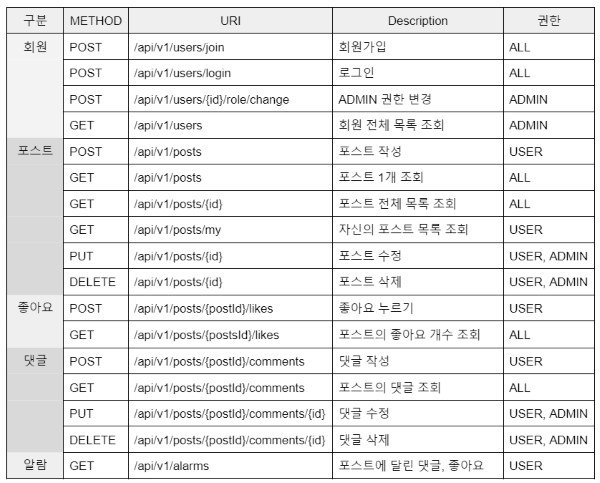

 <h2>📧 MutsaSNS</h2>  

## :ocean: 프로젝트 소개
**MutsaSNS** : Mutsa-SNS로, 회원가입, 로그인, 글쓰기, 댓글, 좋아요, 알림 기능을 갖고 있는 SNS  

## :milky_way: 개발 기간
+ 2022-12-19 ~ 2022-01-11  

## :globe_with_meridians: 개발 환경
+ 에디터 : Intellij Ultimate
+ 개발 툴 : SpringBoot 2.7.5
+ 자바 : JAVA 11
+ 빌드 : Gradle 6.8
+ 서버 : AWS EC2
+ 배포 : Docker
+ 데이터베이스 : MySql 8.0
+ 필수 라이브러리 : SpringBoot Web, MySQL, Spring Data JPA, Lombok, Spring Security

## :blue_book: EndPoint

## 🥈 기능 구현 
### Infra
- [x] EC2 생성 및 도커 설치
- [x] gitlab 배포파일 및 ec2 크론탭 설정

### DataBase
- [x] Mysql 구축
- [x] DB 설계

### Swagger UI 
- [x] swagger 설정
- [x] Spring Security에 적용 `SecurityFilterChain`

### Spring Security + JWT 
- [x] 회원가입과 로그인
- [x] admin 권한 구현 (UserRole`enum` > `ADMIN`, `USER`)

### Spring Boot
- [x] 게시글 CRUD 구현
- [x] 댓글 CRUD 구현
- [x] 좋아요 누르기, 조회 기능 구현
- [x] 마이피드 기능 구현
- [x] 알람 기능 구현 (AlarmType `enum` > `좋아요`, `댓글`)
- [x] Entity에 soft delete 적용
- [x] 예외 처리 `@exceptionHandler`
- [x] Jpa Auditing

### Test Code
- [x] controller 테스트 코드
    - user, post, like, comment, alarm
- [ ] service 테스트 코드

### features [📜Link](https://fishy-column-c27.notion.site/7b156fe0cf32457c8dbd4b5247657ad0?pvs=4)
---
### ERD [🖼Link](https://fishy-column-c27.notion.site/ERD-1d490e69f1c741e2a5e802f2a55cd642?pvs=4)

---
## 🔮 구조 

#### Architecture
- 레이어 아키텍처
    - 역할에 따라 독립된 모듈로 나누어서 구성하는 패턴입니다. 
    - 각 모듈이 서로의 의존도에 따라 층층히 쌓듯이 연결되어서 전체의 시스템을 구현하는 구조
    - 특징 : 단방향 의존성. 각각의 레이어는 오직 자기보다 하위에 있는 레이어에만 의존

## ✒ 회고
#### 신경 쓴 부분
Dto 설계를 할 때 하나의 클래스가 한 가지 기능만 갖는 `단일 책임 원칙`을 지킬 수 있도록 만들어봤다.
- request dto, response dto
- service controller 사이에서 변환하는 dto

#### 추가사항
Service test 코드 완성하기
- TestInfoFixture을 사용해서 작성

UI 완성 시켜보기
- vue 사용

 
#### 느낀점
1주차와 비교해 헤매는 시간이 줄었다. 낯선 에러들을 만났을 때 구글링하는 법을 조금이나마 터득한 것 같다.😌

한편 테스트 코드 작성에 어려움을 느꼈는데, 추가적으로 JUnit을 공부하면서 익숙해질 때까지 만들어보는 노력이 필요할 것  같다.🤐
